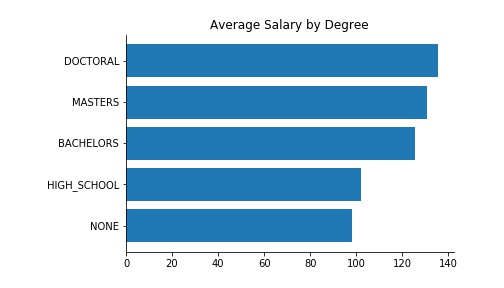
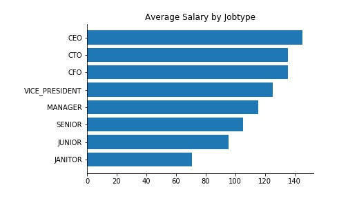
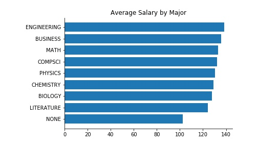

# Salary Prediction Project
This is for the DSDJ salary prediction project.  It is written in Python.
The goal of this project is to build a model that predicts the salaries of various jobs based on existing data for job descriptions at different companies and their corresponding salaries.  The metric used to measure the results is the mean squared error.
This project includes the following:
- [readme file](https://github.com/albert-ntiri/salary_prediction_project/blob/master/README.md)
- [EDA Notebook](https://github.com/albert-ntiri/salary_prediction_project/blob/master/Salary%20Prediction%20Notebook%20EDA.ipynb) where the code is located
- [Models Notebook](https://github.com/albert-ntiri/salary_prediction_project/blob/master/Salary%20Prediction%20Notebook%20Models.ipynb) where the code is located

## Process
To predict the salaries of the provided jobs, I followed the following process:
1. Load the data
2. Explore and clean the data
3. Create features for the models
4. Find the best combination of features and the machine learning algorithm that produced the best results based on a metric of mean squared error

## Data Summary
There were 3 files provided for this project: a list of jobs with different characteristics, a list of salaries for those jobs, and a separate list of jobs to predict salaries for.  To understand the data, I merged the first 2 sets of data so I could explore the characteristics of the first set of jobs.  In this step, I looked at summary statistics on each characteristic and how each characteristic related to salary.  Here is what I found:

 | 
 | 
