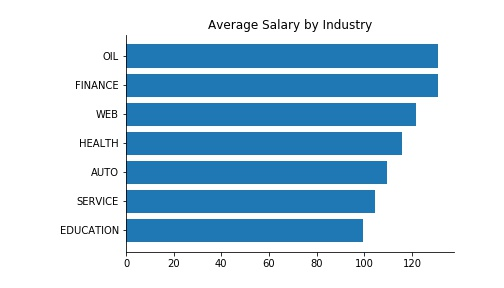
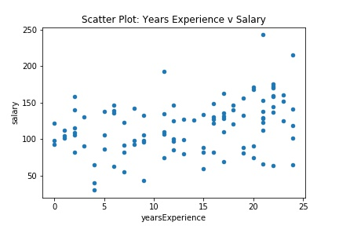
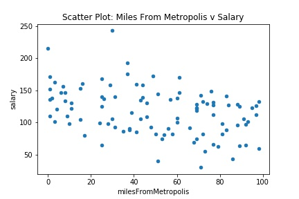
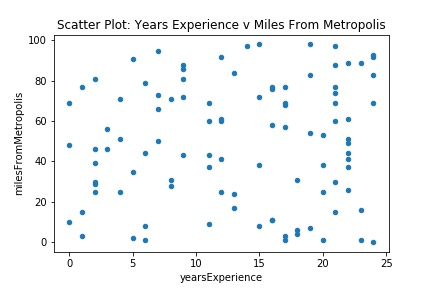
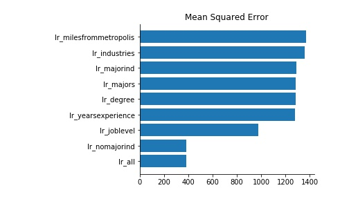

# Salary Prediction Project
The goal of this project is to build a model that predicts the salaries of various jobs based on existing data for job descriptions at different companies and their corresponding salaries.  The code for this project is written in Python.

## Process
To predict the salaries of the provided jobs, I followed the following process:
1. Load the data
2. Explore and clean the data
3. Create features for the models
4. Find the best combination of features and the machine learning algorithm that produced the best results

## Files
This project includes the following:
- [readme file](https://github.com/albert-ntiri/salary_prediction_project/blob/master/README.md) - This is a summary of the project, its goal, links to relevant files, and the results.
- [EDA Notebook](https://github.com/albert-ntiri/salary_prediction_project/blob/master/Salary%20Prediction%20Notebook%20EDA.ipynb) - The EDA Notebook contains the code for exploring the data, cleaning it, using descriptive statistics to understand it, and finding patterns, as well as establishing a baseline model.
- [Models Notebook](https://github.com/albert-ntiri/salary_prediction_project/blob/master/Salary%20Prediction%20Notebook%20Models.ipynb) - The Models Notebook contains the code for preparing the data for modeling, engineering features, determining the best model, and using that model to make the predictions.  In this notebook, I use object-oriented programming to make the process more efficient and the code more organized and readable.

## Data Summary
There were 3 files provided for this project: a list of jobs with different characteristics, a list of salaries for those jobs, and a separate list of jobs to predict salaries for.  To understand the data, I merged the first 2 sets of data so I could explore the characteristics of the first set of jobs.  In this step, I looked at summary statistics on each characteristic and how each characteristic related to salary.

The job descriptions consist of 5 categorical variables (companyId, degree, industry, jobType, major) and 2 numeric variables (yearsExperience, milesFromMetropolis).  Each company in the data set had a similar profile, so I focused on the other 4 categorical variables.  To compare these variables to salary, I grouped by each variable and plotted the average salary for each value in a bar graph.  Here are the results:

|  |  |
|-------------|-----------|
|  |  |

For the numeric variables, I did a scatter plot with salary to see if there was any noticeable correlation.

|  |  |
|-------------|-----------|

Based on this, there is a slight positive correlation between yearsExperience and salary, and a slight negative correlation between milesFromMetropolis and salary.  To see if the 2 numeric variables were independent, I did another scatter plot between them.  Note: Independent variables should have a relatively low correlation to justify including both to explain variation in a dependent variable.  High correlation between independent variables indicates multicollinearity, which affects our ability to determine each variable's predictive power.

The following [correlation matrix](charts/correlation_matrix.csv) confirms what the scatter plots show.

Since there is no correlation between yearsExperience and milesFromMetropolis, both can be included in a model without being redundant.

Lastly, I used Seaborn's FacetGrid to compare the effects of the categorical variables.  That visual can be viewed [here](charts/facetgrid_salarykde_by_industry_jobType_degree.jpg).

## Model Results
To find the best model, I took 2 main steps:
1. Find the most optimal combination of features to include in the model.
2. Determine which algorithm yields the best results based on the mean squared error.  (Mean squared error is a common and useful metric for regression problems.  Other options for regression are the mean absolute error or R^2. An advantage of mean squared error is that it gives a higher weight to large errors.)

Here are the results of each step.

As shown, the best combinations of features are including all of them or including all except the major indicator (whether there was a major).  As far as the impact of individual features, the one with the most explanatory power for salary was the job level.  This is understandable because normally a salary is largely dependent on the responsibilities of the job and where it fits within the hierarchy of a company, which is what job level represents.  Each of the other features (major, degree, industry, years of experience, and miles from metropolis) still had an impact on the score of the model, however, which is why I included all of them.  If there was an issue of including too many features, the major indicator could have been used as a substitute for the major dummy variables, however, it did not have a major effect on the results.

With all features determined as the best combination, I then did a second comparison with those features for different algorithms.

Based on those, the final model was the decision tree model with gradient boosting.  This is likely due to the iterative technique of building on each previous model by only addressing the error.

A commonly-used technique to achieve more accurate results for a model is cross validation.  When applying this technique, the results were very similar.  However, they significantly slowed down the performance.  As a result, the production model I chose does not include cross validation.
